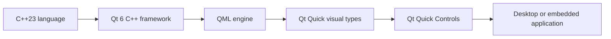
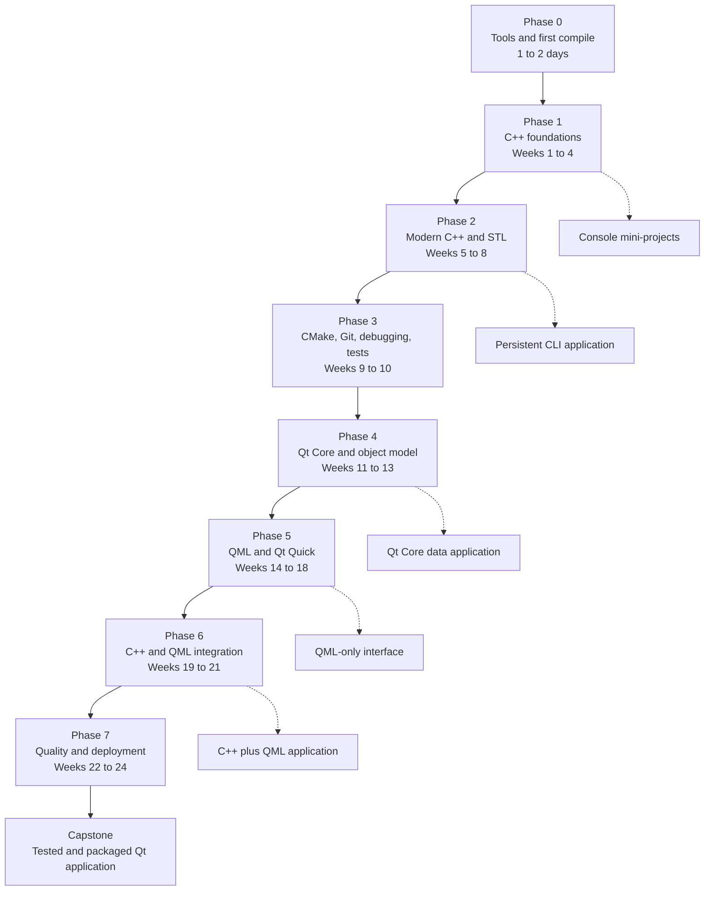
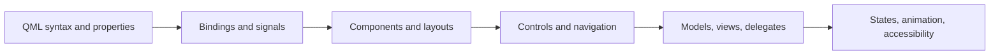
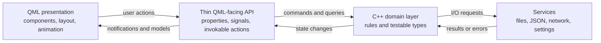
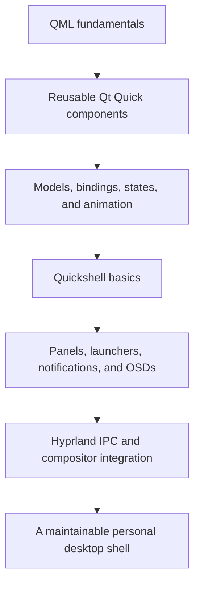

# E Gurl Community Edition: C++23 + Qt 6 + QML Roadmap

**Free community learning guide · CC BY 4.0 · Updated 2026-08-17 · Resources last verified 2026-08-16**

[License](LICENSE.md) · [How to contribute](CONTRIBUTING.md)

> [!NOTE]
> **Start here**
> This is a free, beginner-friendly path from a first C++ program to a polished Qt Quick application with a C++ backend and QML interface. Plan for roughly **24 weeks at 8–10 hours per week**. The weeks are pacing suggestions, not deadlines. Advance when you can pass each phase's completion test.

## What this roadmap teaches

- Modern programming fundamentals using **C++23**.
- Safe ownership, RAII, standard containers, algorithms, and error handling.
- CMake, Git, debugging, automated tests, sanitizers, and static analysis.
- Qt Core, `QObject`, signals and slots, events, files, JSON, networking, and models.
- QML, Qt Quick, Qt Quick Controls, layouts, states, animation, and accessibility.
- A maintainable C++ backend connected to a QML frontend.
- Testing, profiling, deployment, and a portfolio-quality capstone.
- An optional later route into Quickshell and Linux desktop-shell development.

It does **not** require prior C++, Qt, QML, or GUI experience.

## Contents

- [Technology map and recommended versions](#1-the-technology-map)
- [Complete visual roadmap](#2-the-complete-visual-roadmap)
- [Choose your starting point](#choose-your-starting-point)
- [Your first seven days](#your-first-seven-days)
- [How to study effectively](#3-how-to-study-effectively)
- [Beginner glossary](#beginner-glossary)
- [Phase 0: Tools and first compile](#4-phase-0--tools-and-the-first-compile)
- [Phase 1: C++ foundations](#5-phase-1--c-foundations)
- [Phase 2: Modern C++ and the standard library](#6-phase-2--modern-c-and-the-standard-library)
- [Phase 3: Engineering tools](#7-phase-3--cmake-git-debugging-and-tests)
- [Phase 4: Qt Core](#8-phase-4--qt-core-and-the-qt-object-model)
- [Phase 5: QML and Qt Quick](#9-phase-5--qml-qt-quick-and-controls)
- [Phase 6: C++ and QML integration](#10-phase-6--connecting-c-and-qml)
- [Phase 7: Quality and deployment](#11-phase-7--quality-performance-and-deployment)
- [Capstone specification](#12-capstone-specification)
- [Project ladder](#13-project-ladder)
- [Starter Qt Quick project](#14-a-modern-qt-quick-starter-project)
- [Troubleshooting quick reference](#troubleshooting-quick-reference)
- [Resources and YouTube channels](#15-free-curriculum-and-documentation)
- [Topics to postpone](#16-topics-to-postpone)
- [Optional Quickshell path](#17-optional-specialization--quickshell-and-linux-shells)
- [Qt licensing](#18-qt-licensing-in-plain-language)
- [Frequently asked questions](#frequently-asked-questions)
- [Graduation checklist](#19-graduation-checklist)

---

## 1. The technology map

| Name | What it is | What it does in an application |
|---|---|---|
| **C++23** | A compiled programming-language standard | Implements data, rules, algorithms, services, and performance-sensitive work |
| **Qt 6** | A cross-platform C++ framework | Supplies application infrastructure such as events, files, networking, threads, models, and UI libraries |
| **QML** | Qt's declarative UI language | Describes object trees, properties, bindings, signals, and UI behavior |
| **Qt Quick** | The main visual QML library | Supplies visual items, input, animation, models, views, and scene-graph rendering |
| **Qt Quick Controls** | Ready-made QML controls | Supplies windows, buttons, text fields, menus, dialogs, sliders, and styles |
| **CMake** | A build-system generator | Describes source files, dependencies, targets, tests, installation, and deployment |
| **Compiler** | GCC, Clang, or MSVC | Translates C++ source code into native machine code |
| **IDE/editor** | A coding environment | Helps edit, build, navigate, run, and debug; Qt Creator is the easiest Qt-first option |

QML is not a separate product with its own independently installed “QML 6” release. The QML language, engine, modules, and tooling ship with Qt.



*Text version:* C++ supplies the language, Qt supplies the application framework, QML supplies the declarative object language, and Qt Quick plus Qt Quick Controls supply the visual interface.

### What versions should a beginner use?

| Component | Recommendation |
|---|---|
| C++ | Learn **C++23**. Add C++26 features later as compiler support and teaching material mature. |
| Qt | Use the **latest stable Qt 6 patch** available. At the last verification, the newest official release was Qt 6.11.1. |
| QML imports | Prefer modern unversioned imports such as `import QtQuick` and `import QtQuick.Controls` in new Qt 6 projects. |
| Build system | Use modern target-based **CMake** and `qt_add_qml_module()`. |
| Qt UI stack | Prefer **QML + Qt Quick + Qt Quick Controls** for the applications targeted by this guide. |
| C++ compiler mode | Request C++23, but verify individual library features against the compiler's support table. |

> [!NOTE]
> **Version policy**
> The curriculum targets C++23 and modern Qt 6 rather than locking every learner to one patch release. Use the newest stable Qt 6 patch practical for the target platform. The starter project requires Qt 6.5 or newer. Version-sensitive statements were last reviewed on **2026-08-16**.

Authoritative references:

- [Published ISO C++23 standard](https://www.iso.org/standard/83626.html)
- [Current ISO C++ status](https://isocpp.org/std/status)
- [Qt 6.11.1 release announcement](https://www.qt.io/blog/qt-6.11.1-released)
- [Current Qt 6 documentation](https://doc.qt.io/qt-6/)
- [Getting started with Qt Quick applications](https://doc.qt.io/qt-6/qmlapplications.html)
- [`qt_add_qml_module()` documentation](https://doc.qt.io/qt-6/qt-add-qml-module.html)

---

## 2. The complete visual roadmap



*Text version:* Learn C++ foundations, modern C++, engineering tools, Qt Core, QML and Qt Quick, C++/QML integration, and finally testing and deployment. Each major phase produces a project.

### Phase overview

| Phase | Suggested time | Main outcome |
|---|---:|---|
| 0. Orientation | 1–2 days | Compile, run, and debug a program |
| 1. C++ foundations | 4 weeks | Write small multi-file console programs |
| 2. Modern C++ | 4 weeks | Manage lifetime safely and use the standard library |
| 3. Engineering tools | 2 weeks | Build, test, debug, analyze, and version projects |
| 4. Qt Core | 3 weeks | Understand Qt's event-driven C++ model |
| 5. QML and Qt Quick | 5 weeks | Build a responsive, accessible interface |
| 6. C++ and QML | 3 weeks | Connect a clean backend to a declarative frontend |
| 7. Shipping quality | 3 weeks | Test, profile, package, and document a capstone |

### Choose a pace

| Track | Weekly commitment | Approximate duration | Best for |
|---|---:|---:|---|
| Relaxed | 4–5 hours | 36–40 weeks | School, work, or other major commitments |
| Standard | 8–10 hours | About 24 weeks | A sustainable default for most learners |
| Intensive | 15–20 hours | 12–16 weeks | Learners who can code nearly every day |

The calendar is only a pacing tool. Advance when the phase project works and the completion tests can be passed without copying a solution.

---

## Choose your starting point

This roadmap is written for complete beginners, but experienced learners do not need to repeat material they can already demonstrate. Choose a starting point by **proof**, not by how familiar a topic sounds.

| Current experience | Recommended start | Proof to complete before skipping ahead |
|---|---|---|
| New to programming or unable to compile without instructions | [Phase 0](#4-phase-0--tools-and-the-first-compile) | Compile, run, deliberately break, and repair a small program; explain source, compiler, linker, and executable |
| Comfortable with basic syntax but not multi-file C++ | [Phase 1](#5-phase-1--c-foundations) | Write small programs with functions, conditions, loops, strings, and input validation |
| Comfortable with classes, containers, and multi-file programs | Try the Phase 1 completion tests, then enter [Phase 2](#6-phase-2--modern-c-and-the-standard-library) | Build the Phase 1 contact or inventory project from an empty folder without a tutorial |
| Comfortable with modern C++ ownership and the standard library, but not engineering tools | [Phase 3](#7-phase-3--cmake-git-debugging-and-tests) | Explain RAII and object lifetime, then build the Phase 2 CLI project |
| Comfortable with modern C++, CMake, Git, debugging, and tests, but new to Qt | [Phase 4](#8-phase-4--qt-core-and-the-qt-object-model) | Configure, build, test, and debug a clean CMake project from its README |
| Familiar with Qt C++ but new to QML and Qt Quick | [Phase 5](#9-phase-5--qml-qt-quick-and-controls) | Explain the Qt event loop, `QObject` ownership, signals, slots, and thread affinity |
| Able to build reusable QML interfaces but new to C++ integration | [Phase 6](#10-phase-6--connecting-c-and-qml) | Build a QML interface with bindings, controls, models, delegates, states, keyboard use, and no unexplained warnings |
| Interested mainly in Quickshell | Complete Phase 5 first; Phase 6 is strongly recommended | Pass the QML phase completion test before entering [the Quickshell path](#17-optional-specialization--quickshell-and-linux-shells) |

> [!TIP]
> **When uncertain, start one phase earlier**
> Repeating a small project quickly costs little. Skipping a weak foundation makes later Qt and QML errors much harder to diagnose.

---

## Your first seven days

Use this section immediately. The detailed explanations appear later in the roadmap.

### Day 1

- [ ] Install or verify the compiler, CMake, Git, and an IDE/editor.
- [ ] Compile and run the first C++ program.
- [ ] Change the greeting and deliberately create one compiler error.

### Day 2

- [ ] Learn variables, initialization, types, and input/output.
- [ ] Build a temperature converter.

### Day 3

- [ ] Learn conditions and loops.
- [ ] Build FizzBuzz and begin a number-guessing game.

### Day 4

- [ ] Learn functions and scope.
- [ ] Refactor the guessing game into functions.

### Day 5

- [ ] Learn strings and vectors.
- [ ] Build a small grade tracker.

### Day 6

- [ ] Use a debugger on the guessing game.
- [ ] Fix at least one issue by inspecting state rather than guessing.

### Day 7

- [ ] Rebuild one program from an empty folder without notes.
- [ ] Commit the week's projects to Git.
- [ ] Write three lessons learned and choose next week's exercises.

---

## 3. How to study effectively

Use this loop for every topic:

1. Read or watch one small lesson.
2. Type the example yourself; do not paste it.
3. Predict the result before compiling or running it.
4. Change at least two parts and explain what changed.
5. Recreate the core idea with the lesson closed.
6. Use it in a small exercise or project.
7. Write down only the insight or mistake worth remembering.

A sustainable 8–10 hour week:

| Activity | Approximate share | Example |
|---|---:|---|
| Writing and changing code | 50% | Exercises and application features |
| Debugging and testing | 20% | Breakpoints, test cases, warnings, sanitizers |
| Lessons and documentation | 20% | One course chapter or focused video |
| Review and notes | 10% | Recall practice and a weekly retrospective |

> [!WARNING]
> **Tutorial familiarity is not programming ability**
> Watching somebody solve a problem feels easier than solving it. Every week must include at least one small program built from an empty folder without a tutorial open.

### The stuck protocol

When code fails:

1. Read the **first** compiler or runtime error completely.
2. Reduce the problem to the smallest reproducible example.
3. State what you expected and what actually happened.
4. Inspect values with a debugger or temporary logging.
5. Check the official documentation for the exact API.
6. Search the exact error only after collecting this evidence.
7. Record the cause and fix in one or two sentences.

---

## Beginner glossary

| Term | Plain-language meaning |
|---|---|
| **Source file** | A human-readable text file containing program code, such as `main.cpp` or `Main.qml` |
| **Compiler** | A program that translates C++ source code into machine code |
| **Linker** | Combines compiled files and libraries into an executable or library |
| **Executable** | A built program that the operating system can run |
| **Runtime** | The period while a program is executing |
| **Library** | Reusable code that an application can call |
| **Framework** | A larger structure and set of conventions used to build an application |
| **API** | The public functions, types, properties, or commands used to interact with code |
| **Build system** | Describes how source files and dependencies become a finished program |
| **Event loop** | Waits for input, timers, messages, and other events, then dispatches the appropriate work |
| **Signal and slot** | Qt's notification mechanism for connecting events to responses |
| **Property binding** | A QML relationship that automatically recalculates a property when its dependencies change |
| **Model** | Authoritative data made available to one or more views |
| **View** | A visual structure that displays model data |
| **Delegate** | A component responsible for displaying one model entry |
| **Backend** | The data, rules, persistence, networking, and services behind the visual interface |
| **Frontend** | The visual interface and interaction layer presented to the user |

Return to this glossary whenever a term appears unfamiliar. Understanding the idea matters more than memorizing the wording.

> [!TIP]
> **Required now versus later**
> Treat fundamentals, projects, and completion tests as required. Treat advanced templates, custom allocators, lock-free concurrency, deep coroutine machinery, custom scene-graph rendering, and Qt private APIs as later specializations. Recognition is enough until a real project needs them.

---

## 4. Phase 0 — Tools and the first compile

> [!IMPORTANT]
> **Phase outcome**
> Understand the basic build pipeline and compile, run, and debug a small C++ program.

| Prerequisite | Suggested time | Main proof |
|---|---:|---|
| None | 1–2 days | A working program and an explanation of how source becomes an executable |

### Install or locate

- A C++ compiler with useful C++23 support: recent GCC, Clang, or MSVC.
- CMake and preferably Ninja.
- Git.
- The latest stable Qt 6 development package, including Qt Core, QML, Qt Quick, and Qt Quick Controls.
- An editor or IDE. Qt Creator is the most direct beginner experience for Qt and QML, but the project remains a normal CMake project and is not locked to an IDE.

The [Qt download page](https://www.qt.io/download-open-source) provides the official open-source installer. Linux distributions also package Qt, although package names and versions vary.

Check the tools that apply to the system:

```bash
g++ --version
clang++ --version
cmake --version
ninja --version
git --version
qtpaths6 --qt-version
```

Only one working C++ compiler is required.

### First C++ program

Create `main.cpp`:

```cpp
#include <iostream>
#include <string>

int main()
{
    std::cout << "What is your name? ";

    std::string name;
    std::getline(std::cin, name);

    std::cout << "Hello, " << name << "!\n";
}
```

With GCC or Clang, compile with warnings enabled:

```bash
g++ -std=c++23 -Wall -Wextra -Wpedantic main.cpp -o hello
./hello
```

On Windows PowerShell, the final command is normally:

```powershell
.\hello.exe
```

### Completion test

Explain this path in plain language:

```text
source file -> preprocessor -> compiler -> object file -> linker -> executable -> operating system
```

Also recognize the difference between:

- **Compiler error:** a source file cannot be translated.
- **Linker error:** compiled pieces cannot be combined, often because a definition is missing.
- **Runtime error:** the executable starts but behaves incorrectly or terminates.

- [ ] I can explain the build pipeline without looking it up.
- [ ] I can distinguish a compiler error, linker error, and runtime error from a simple example.

---

## 5. Phase 1 — C++ foundations

> [!IMPORTANT]
> **Phase outcome**
> Write small multi-file C++ programs using functions, containers, algorithms, files, and simple classes.

| Prerequisite | Suggested time | Main proof |
|---|---:|---|
| Phase 0 or equivalent tool familiarity | 4 weeks | A multi-file console application built without a tutorial open |

Use [LearnCpp](https://www.learncpp.com/) as the main written course. It is free and teaches modern C++ progressively. Use [cppreference](https://en.cppreference.com/w/cpp) to look up known topics; it is a reference, not a beginner course.

### Week 1 — Values and control flow

Learn:

- Program structure and `main()`.
- Statements, expressions, variables, initialization, and assignment.
- Integers, floating-point types, `bool`, and `char`.
- Console input and output.
- Operators, conversions, and integer division.
- `if`, `else`, `switch`, `while`, and `for`.
- Scope and compiler warnings.

**Required project:** build a menu-driven calculator with input validation.

**Choose one additional exercise:**

- Temperature converter.
- Number-guessing game.

- [ ] **Completion test:** write FizzBuzz and the calculator from an empty file.

### Week 2 — Functions and files

Learn:

- Function declarations, definitions, parameters, and return values.
- Pass by value, reference, and const reference.
- Local versus global scope; avoid mutable global state.
- Header/source separation and include guards.
- Namespaces, `const`, `auto`, `enum class`, and simple `struct` types.

**Required project:** build a multi-file unit converter.

**Choose one additional exercise:**

- Rock-paper-scissors with functions for each rule.
- A small reusable math or text utility library.

- [ ] **Completion test:** explain why each declaration and definition lives in its selected file.

### Week 3 — Strings, containers, and algorithms

Learn:

- `std::string` and `std::string_view`.
- `std::array` and `std::vector`.
- Range-based loops and basic iterator concepts.
- `std::find`, `std::count`, `std::sort`, and `std::transform`.
- Basic lambdas and predicates.
- Text-file input and output.
- Separating data, logic, and presentation.

**Required project:** build a contact list stored in a simple text format.

**Choose one additional exercise:**

- Word-frequency counter.
- Grade tracker with statistics.

- [ ] **Completion test:** load records, filter them, sort them, calculate a result, and save them.

### Week 4 — Classes and object design

Learn:

- Classes, access control, constructors, and invariants.
- Member functions and `const` member functions.
- Composition before inheritance.
- Basic inheritance and virtual functions for recognition.
- Operator overloading only where it makes a type clearer.
- Keeping input/output outside domain objects.

**Required project:** build an inventory containing products.

**Choose one additional exercise:**

- Bank-account model with enforced invariants.
- Small turn-based combat model.

- [ ] **Completion test:** design two collaborating classes without public mutable data.

---

## 6. Phase 2 — Modern C++ and the standard library

> [!IMPORTANT]
> **Phase outcome**
> Manage ownership and lifetime safely while using modern standard-library types and algorithms.

| Prerequisite | Suggested time | Main proof |
|---|---:|---|
| Phase 1 completion tests | 4 weeks | A persistent CLI task tracker with clear ownership and error handling |

### Week 5 — Lifetime, ownership, and RAII

Learn:

- Automatic, static, and dynamic storage duration.
- References versus pointers.
- Stack and free-store concepts without treating them as absolute language guarantees.
- Constructors, destructors, and RAII.
- `std::unique_ptr`, `std::shared_ptr`, and `std::weak_ptr`.
- Why raw pointers usually express non-ownership.
- Rule of zero as the preferred class design.

Avoid manual `new` and `delete` in ordinary application code while learning. Understand them, then use containers and RAII types.

**Required project:** build a tree or scene structure with explicit ownership.

**Choose one additional exercise:**

- Resource-owning class using a standard RAII type.
- Exercise that identifies dangling references and lifetime errors.

- [ ] **Completion test:** draw the owner and expected lifetime of every object in a small program.

### Week 6 — Errors and vocabulary types

Learn:

- Preconditions, invariants, assertions, and exceptions.
- `std::optional`, `std::variant`, and `std::expected`.
- `std::filesystem` and `std::chrono`.
- Templates at a practical introductory level.
- Concepts as readable template constraints.

**Required project:** build a configuration parser that returns useful errors.

**Choose one additional exercise:**

- File organizer with `std::filesystem`.
- Timer or Pomodoro engine using `std::chrono`.

- [ ] **Completion test:** model “missing,” “one of several states,” and “success or error” without magic sentinel values.

### Week 7 — Copying, moving, and library fluency

Learn:

- Copy and move construction conceptually.
- Lvalues, rvalues, and move semantics at a practical level.
- Rule of zero, five, and three; prefer zero.
- Maps, sets, queues, and their tradeoffs.
- Iterator invalidation and algorithm complexity.
- Lambdas with captures.

**Required project:** build a searchable catalog using an appropriate associative container.

**Choose one additional exercise:**

- Benchmark comparing two reasonable container choices.
- Refactor loops into standard algorithms where clarity improves.

- [ ] **Completion test:** justify a container choice using access pattern, ordering, invalidation, and complexity.

### Week 8 — C++20/23 essentials and a CLI project

Prioritize:

- Ranges and views.
- Concepts.
- `std::span`.
- Designated initializers where suitable.
- `std::format` if supported by the chosen standard library.
- `std::expected`.
- Modules as awareness only until the toolchain and project justify them.
- Coroutines as awareness only; learn ordinary control flow and Qt's asynchronous APIs first.

**Required phase project:** build a persistent CLI task tracker with:

- Add, edit, delete, list, filter, and sort.
- File persistence.
- Clear error messages.
- Multiple source files.
- No raw owning pointers.

- [ ] **Completion test:** add a feature without rewriting the whole program and without mixing all input/output into the data classes.

---

## 7. Phase 3 — CMake, Git, debugging, and tests

> [!IMPORTANT]
> **Phase outcome**
> Configure, build, test, debug, analyze, and version a project from a clean checkout.

| Prerequisite | Suggested time | Main proof |
|---|---:|---|
| Phase 2 project | 2 weeks | Another learner can build and test the project from its README |

### CMake

Learn:

- Targets and target properties.
- `add_executable()` and `add_library()`.
- `target_sources()`, `target_link_libraries()`, and `target_include_directories()`.
- `PUBLIC`, `PRIVATE`, and `INTERFACE` usage requirements.
- Out-of-source builds and build types.
- `find_package()` and imported targets.
- CTest and installation rules.

Minimal non-Qt project:

```cmake
cmake_minimum_required(VERSION 3.20)

project(community_cli LANGUAGES CXX)

add_executable(community_cli
    main.cpp
)

target_compile_features(community_cli PRIVATE cxx_std_23)
```

Build it:

```bash
cmake -S . -B build -G Ninja
cmake --build build
ctest --test-dir build --output-on-failure
```

Read the free [official CMake tutorial](https://cmake.org/cmake/help/latest/guide/tutorial/) and the [Qt CMake manual](https://doc.qt.io/qt-6/cmake-manual.html).

### Git

Learn:

- Repository, working tree, staging area, commit, branch, merge, and remote.
- Small commits with messages describing one coherent change.
- `.gitignore` for generated build directories.
- How to inspect a diff before committing.
- How to recover from an ordinary mistake without deleting work blindly.

Read [Pro Git](https://git-scm.com/book/en/v2), which is free online.

### Debugging and quality tools

Practice:

- Breakpoints, stepping, call stacks, watches, and conditional breakpoints.
- Compiler warnings and treating warnings seriously.
- Debug builds with symbols.
- AddressSanitizer and UndefinedBehaviorSanitizer on supported compilers.
- A unit-test framework such as Qt Test, Catch2, or GoogleTest.
- Formatting with `clang-format`.
- Static analysis with `clang-tidy`.

Example sanitizer configuration for GCC or Clang:

```cmake
target_compile_options(community_cli PRIVATE
    $<$<CONFIG:Debug>:-fsanitize=address,undefined -fno-omit-frame-pointer>
)

target_link_options(community_cli PRIVATE
    $<$<CONFIG:Debug>:-fsanitize=address,undefined>
)
```

- [ ] **Completion test:** configure, build, test, and debug a project from a fresh clone using only its README.

---

## 8. Phase 4 — Qt Core and the Qt object model

> [!IMPORTANT]
> **Phase outcome**
> Build an event-driven Qt Core application that handles data and asynchronous work without blocking.

| Prerequisite | Suggested time | Main proof |
|---|---:|---|
| C++ classes, RAII, CMake, debugging, and tests | 3 weeks | A tested Qt Core timer, data application, or API client |

Start with [Create Your First Applications](https://doc.qt.io/qt-6/create-your-first-applications.html), the [Qt 6 documentation](https://doc.qt.io/qt-6/), and the examples installed with Qt.

### Week 11 — Qt foundations

Learn:

- `QCoreApplication` and the event loop.
- `QObject` identity and parent-child ownership.
- Signals, slots, and connection syntax.
- `QString`, `QByteArray`, Qt containers, and when the standard library is preferable.
- `QTimer` and event-driven thinking.
- Qt value types versus `QObject` subclasses.

**Required project:** build a console countdown timer using `QTimer`.

**Choose one additional exercise:**

- Event-driven status monitor.
- Small signal-and-slot experiment with custom objects.

- [ ] **Completion test:** explain why a long blocking operation freezes an event-loop thread.

### Week 12 — Files, JSON, settings, and networking

Learn:

- `QFile`, `QDir`, `QFileInfo`, and standard paths.
- `QJsonDocument`, objects, and arrays.
- `QSettings`.
- `QUrl`.
- `QNetworkAccessManager`, replies, errors, and asynchronous results.

**Required project:** build a small API client with loading, success, empty, and error states.

**Optional additional exercise:** build a JSON-backed settings or notes service.

- [ ] **Completion test:** retrieve or load data asynchronously and report failures without blocking the UI thread.

### Week 13 — Models, threads, and Qt Test

Learn:

- Model/View ideas and roles.
- `QAbstractListModel` conceptually.
- Thread affinity and queued connections.
- Worker-object pattern.
- `QtConcurrent` or asynchronous APIs when appropriate.
- Qt Test structure and data-driven tests.

Do not move work to a thread automatically. First determine whether the work blocks and whether an asynchronous Qt API already exists.

**Required project:** build an in-memory list model with tests for its domain rules and JSON conversion.

**Optional additional exercise:** add a background calculation with safe result delivery.

- [ ] **Completion test:** explain which thread owns each `QObject` and how results cross thread boundaries.

---

## 9. Phase 5 — QML, Qt Quick, and Controls

> [!IMPORTANT]
> **Phase outcome**
> Build a responsive, reusable, accessible interface using QML, Qt Quick, and Qt Quick Controls.

| Prerequisite | Suggested time | Main proof |
|---|---:|---|
| Phase 1 C++ foundations and basic Qt concepts | 5 weeks | A polished QML dashboard with multiple states and no unexplained warnings |

Use the official [QML for Beginners YouTube playlist](https://www.youtube.com/playlist?list=PLizsthdRd0YwxekSSxUr5QVKIMKm6Y7bu) and the free [Qt Academy catalog](https://www.qt.io/academy/course-catalog) as the primary course.



*Text version:* Start with QML syntax and bindings, then build reusable layouts and controls, connect data through models and delegates, and finish with states, animation, debugging, and accessibility.

### Week 14 — QML language fundamentals

Learn:

- Object declarations and the object tree.
- IDs, typed properties, aliases, signals, and signal handlers.
- Declarative bindings versus imperative assignments.
- Reusable component files.
- JavaScript expressions used sparingly for presentation logic.
- Modern unversioned imports.

**Required project:** build a unit converter with live property bindings.

**Choose one additional exercise:**

- Profile card.
- Counter with reusable controls.

- [ ] **Completion test:** explain why assigning to a bound property may replace its binding.

### Week 15 — Layout and responsive UI

Learn:

- `Item`, `Rectangle`, `Text`, and `Image`.
- Anchors, positioners, and Qt Quick Layouts.
- `implicitWidth`, `implicitHeight`, and size propagation.
- Avoiding conflicting anchors and layout properties.
- DPI-aware sizing and responsive structure.
- Focus, keyboard navigation, and pointer handlers.

**Required project:** build a responsive dashboard that works at several window sizes.

**Optional stretch:** extract reusable card, toolbar, and empty-state components.

- [ ] **Completion test:** resize the interface aggressively without overlaps or clipped essential content.

### Week 16 — Controls and application structure

Learn:

- `ApplicationWindow` and common Qt Quick Controls.
- Control styling versus replacing internal implementation details.
- Pages, stack navigation, drawers, dialogs, menus, and actions.
- Resource organization and QML modules.
- Theme tokens instead of duplicated literal colors and dimensions.

**Required project:** build a multi-page settings application.

**Optional stretch:** add a light/dark theme based on centralized tokens.

- [ ] **Completion test:** add a new page and navigation action without editing unrelated components.

### Week 17 — Models, views, and delegates

Learn:

- Model, view, delegate, and role responsibilities.
- `ListModel` for prototypes.
- `ListView`, `GridView`, delegate reuse, and required properties.
- Selection, filtering, sorting, and empty states.
- Why delegates should not own authoritative application data.

**Required project:** build a contact browser.

**Optional additional project:** build a media or application launcher UI with filtering.

- [ ] **Completion test:** replace the prototype model without redesigning the delegate.

### Week 18 — States, animation, debugging, and polish

Learn:

- States, transitions, behaviors, and explicit animations.
- Loaders and delayed component creation.
- QML logging, debugger, profiler, and object inspection.
- `qmllint` and `qmlformat`.
- Accessible names, descriptions, keyboard use, contrast, and motion restraint.

**Required project:** build a polished dashboard with loading, error, empty, and populated states.

**Optional additional project:** build an animated notification center.

- [ ] **Completion test:** the application works by keyboard, communicates state clearly, and has no unexplained QML warnings.

---

## 10. Phase 6 — Connecting C++ and QML

> [!IMPORTANT]
> **Phase outcome**
> Connect a testable C++ backend to a declarative QML frontend through focused APIs and models.

| Prerequisite | Suggested time | Main proof |
|---|---:|---|
| Qt Core plus QML models, views, delegates, and bindings | 3 weeks | A C++ and QML task manager with persistence and automated tests |

### Target architecture



*Text version:* QML sends user actions to a small public API. That API coordinates testable C++ domain logic and services. Results return to QML through properties, signals, and models.

Keep visual structure and small interactions in QML. Keep authoritative data, business rules, persistence, networking, and substantial computation in C++. Avoid C++ code that searches the QML object tree by object ID.

### Week 19 — Exposing types and state

Learn:

- `Q_PROPERTY`, notification signals, and bindable state.
- Invokable methods and slots.
- `QML_ELEMENT` and declarative type registration.
- Context properties for understanding legacy examples, not as the default architecture.
- Ownership boundaries between C++ and the QML engine.
- Converting domain values to QML-friendly APIs.

Use the free Qt Academy courses [How to Expose C++ to QML](https://www.qt.io/academy/course-catalog) and [Introduction to Signals and Slots](https://www.qt.io/academy/course-catalog).

**Required project:** build a C++ settings service displayed and edited from QML.

**Optional additional exercise:** add a backend status object with observable properties.

- [ ] **Completion test:** a C++ state change updates QML through notification, without polling.

### Week 20 — C++ models in QML

Learn:

- Subclassing `QAbstractListModel`.
- Custom roles and `roleNames()`.
- Correct begin/end calls for insert, remove, reset, and move operations.
- Emitting `dataChanged()` with accurate indexes and roles.
- Proxy models where suitable.

**Required project:** build a C++ task model displayed by a QML `ListView`, with actions to add, edit, remove, filter, and persist tasks.

- [ ] **Completion test:** individual changes update the correct delegate without resetting the entire model.

### Week 21 — Application architecture

Learn:

- Presentation, domain, and service boundaries.
- Dependency injection with ordinary constructors.
- Asynchronous operations and explicit loading/error state.
- Cancellation, timeouts, retries, and application shutdown.
- Test doubles around filesystem or network boundaries.
- Keeping domain logic independent of visual components.

**Required phase project:** build a task manager with:

- C++ domain rules and list model.
- QML pages, delegates, dialogs, and responsive layout.
- JSON persistence.
- Unit tests for domain rules and serialization.
- Clear loading, error, empty, and populated states.

- [ ] **Completion test:** domain tests run without starting a graphical application.

---

## 11. Phase 7 — Quality, performance, and deployment

> [!IMPORTANT]
> **Phase outcome**
> Test, profile, package, document, and release a portfolio-quality Qt application.

| Prerequisite | Suggested time | Main proof |
|---|---:|---|
| Completed C++ and QML integration project | 3 weeks | A release build that another person can install, test, and understand |

### Week 22 — Testing

Create a small test pyramid:

- Many fast C++ unit tests for rules and transformations.
- Model tests for roles and mutation behavior.
- QML tests for important components.
- A few end-to-end flows for critical user journeys.

Learn Qt Test, [Qt Quick Test](https://doc.qt.io/qt-6/qtquicktest-index.html), CTest integration, fixtures, parameterized tests, and deterministic handling of time and network behavior.

- [ ] **Completion test:** introduce a deliberate regression, observe a relevant test fail, fix it, and watch the test pass.

### Week 23 — Diagnostics and performance

Learn:

- Measure before optimizing.
- QML Profiler and C++ sampling profilers.
- Binding loops, unnecessary reevaluation, heavy delegates, and excessive object creation.
- Logging categories and actionable error messages.
- Sanitizers and static analysis in regular development.
- `qmllint` and QML compiler warnings.

- [ ] **Completion test:** identify one measured bottleneck, improve it, and preserve before/after evidence.

### Week 24 — Deployment and capstone

Learn:

- Release builds and platform deployment tools.
- QML module and plugin deployment.
- Runtime assets, fonts, translations, and licenses.
- Versioning, changelog, README, screenshots, and installation instructions.
- Continuous integration that builds and tests a clean checkout.

Follow the official [Qt deployment documentation](https://doc.qt.io/qt-6/deployment.html) because deployment differs across Linux, Windows, macOS, mobile, and embedded targets.

- [ ] **Completion test:** produce a documented release build from a clean checkout and verify it on the intended target platform.

---

## 12. Capstone specification

Build an **expense tracker**, **study planner**, **media organizer**, or similarly sized application.

Required features:

- A modern Qt 6 CMake project.
- C++23 domain types and rules.
- A QML/Qt Quick Controls frontend.
- A C++ list model exposed to QML.
- Persistent JSON or SQLite storage.
- Filtering, sorting, and search.
- Responsive layout and keyboard navigation.
- Loading, empty, populated, and error states.
- Automated tests for core rules and persistence.
- No unexplained compiler, QML, or static-analysis warnings.
- A release build and documented installation process.
- README with screenshots, architecture, controls, build instructions, known limitations, and license.

### Capstone evaluation rubric

| Area | Passing requirement |
|---|---|
| Functionality | Every primary workflow works without a crash or silent failure |
| Architecture | Domain rules and data ownership do not depend on visual QML components |
| Models | Individual changes update the correct delegates without unnecessary full resets |
| Persistence | Saved data survives a restart and malformed input produces a useful error |
| Testing | Important rules, conversions, and persistence behavior have automated tests |
| Error states | Loading, empty, populated, offline, and failure states are communicated clearly |
| Accessibility | Primary workflows are usable by keyboard and important controls have accessible labels |
| Diagnostics | There are no unexplained compiler, QML, sanitizer, or static-analysis warnings |
| Documentation | Another person can build, test, and use the application from its instructions |
| Deployment | A release build runs on a clean instance of the intended platform |

### Definition of done

The capstone is complete when another person can clone it, follow the README, build it, run its tests, understand its architecture, and use its primary workflow without private instructions.

---

## 13. Project ladder

| Level | Project | Main skills |
|---:|---|---|
| 1 | Calculator | Variables, input, functions, conditions |
| 2 | Number-guessing game | Loops, state, validation, random numbers |
| 3 | Grade or contact tracker | Strings, vectors, algorithms, files |
| 4 | CLI task tracker | Classes, architecture, persistence, errors |
| 5 | Qt Core timer or API client | Event loop, signals, slots, async behavior |
| 6 | QML dashboard | Bindings, components, layouts, controls |
| 7 | QML contact browser | Models, views, delegates, filtering |
| 8 | C++ and QML task manager | Properties, signals, C++ list model, storage |
| 9 | Capstone | Tests, profiling, accessibility, packaging |

Do not make every practice project a calculator. Reuse the same concept in different domains so the idea becomes transferable.

---

## 14. A modern Qt Quick starter project

This example uses C++23, CMake, Qt Quick, a QML module, modern unversioned imports, and a small C++ object exposed to QML. It requires Qt 6.5 or newer so it remains usable across several recent Qt 6 releases.

### Directory structure

```text
community-hello/
├── CMakeLists.txt
├── greetingcontroller.h
├── main.cpp
└── Main.qml
```

### `CMakeLists.txt`

```cmake
cmake_minimum_required(VERSION 3.21)

project(CommunityHello VERSION 1.0 LANGUAGES CXX)

find_package(Qt6 6.5 REQUIRED COMPONENTS Quick)

qt_standard_project_setup(REQUIRES 6.5)

qt_add_executable(CommunityHello
    main.cpp
)

target_compile_features(CommunityHello PRIVATE cxx_std_23)

qt_add_qml_module(CommunityHello
    URI Community.Hello
    VERSION 1.0
    SOURCES
        greetingcontroller.h
    QML_FILES
        Main.qml
)

target_link_libraries(CommunityHello PRIVATE Qt6::Quick)

install(TARGETS CommunityHello
    BUNDLE DESTINATION .
    RUNTIME DESTINATION bin
)
```

### `greetingcontroller.h`

```cpp
#pragma once

#include <QObject>
#include <QString>
#include <QtQml/qqmlregistration.h>

class GreetingController : public QObject
{
    Q_OBJECT
    QML_ELEMENT
    Q_PROPERTY(QString greeting READ greeting NOTIFY greetingChanged FINAL)

public:
    explicit GreetingController(QObject* parent = nullptr)
        : QObject(parent)
    {
    }

    [[nodiscard]] QString greeting() const
    {
        return m_greeting;
    }

    Q_INVOKABLE void greet(const QString& name)
    {
        const QString cleanedName{ name.trimmed() };
        const QString nextGreeting{ cleanedName.isEmpty()
            ? QStringLiteral("Hello from C++!")
            : QStringLiteral("Hello, %1!").arg(cleanedName) };

        if (nextGreeting == m_greeting) {
            return;
        }

        m_greeting = nextGreeting;
        emit greetingChanged();
    }

signals:
    void greetingChanged();

private:
    QString m_greeting{ QStringLiteral("Hello from C++!") };
};
```

### `main.cpp`

```cpp
#include <QGuiApplication>
#include <QQmlApplicationEngine>

int main(int argc, char* argv[])
{
    QGuiApplication app(argc, argv);

    QQmlApplicationEngine engine;
    engine.loadFromModule("Community.Hello", "Main");

    if (engine.rootObjects().isEmpty()) {
        return -1;
    }

    return app.exec();
}
```

### `Main.qml`

```qml
import QtQuick
import QtQuick.Controls
import QtQuick.Layouts

ApplicationWindow {
    width: 640
    height: 420
    visible: true
    title: qsTr("E Gurl Community")

    ColumnLayout {
        anchors.centerIn: parent
        spacing: 16
        width: Math.min(parent.width - 48, 360)

        GreetingController {
            id: controller
        }

        Label {
            text: controller.greeting
            font.pixelSize: 28
            Layout.alignment: Qt.AlignHCenter
        }

        TextField {
            id: nameField
            placeholderText: qsTr("Enter your name")
            Layout.fillWidth: true
            onAccepted: controller.greet(text)
        }

        Button {
            text: qsTr("Ask C++ to greet me")
            Layout.alignment: Qt.AlignHCenter
            onClicked: controller.greet(nameField.text)
        }
    }
}
```

The bridge has four parts:

1. `QML_ELEMENT` registers `GreetingController` in the QML module.
2. `Q_PROPERTY` exposes readable C++ state to QML.
3. `Q_INVOKABLE` lets the button request a C++ action.
4. `greetingChanged()` tells QML to reevaluate `controller.greeting` only when the value changes.

### Build and run

```bash
cmake -S . -B build -G Ninja
cmake --build build
./build/CommunityHello
```

The executable location can differ with multi-configuration generators and on Windows. An IDE can configure and run the same `CMakeLists.txt` directly.

Run the generated QML lint target when available:

```bash
cmake --build build --target CommunityHello_qmllint
```

---

## Troubleshooting quick reference

Start with the first complete error, not the last line of a long error cascade. Save every edited file, run the build from a terminal when possible, and confirm that the command is using the project and build directory you expect.

| Symptom | Likely cause | First useful check |
|---|---|---|
| `g++`, `clang++`, `cmake`, or `ninja` is not found | The tool is not installed or is missing from `PATH` | Run the corresponding `--version` command from Phase 0 |
| CMake cannot find `Qt6Config.cmake` | Qt development files are missing or CMake is looking at a different Qt installation | Check the selected Qt Creator kit or the Qt installation prefix; do not download individual libraries from random websites |
| `Could not create named generator Ninja` | Ninja is unavailable | Install Ninja or configure without `-G Ninja` so CMake chooses another available generator |
| `undefined reference` or `unresolved external symbol` | A definition is missing, a source file is absent from the target, or a declaration and definition do not match | Compare the complete function signatures and inspect the target's source list in `CMakeLists.txt` |
| The build succeeds but the executable is not at `./build/CommunityHello` | A multi-configuration generator placed it in a configuration subdirectory | Inspect the final build output and check paths such as `build/Debug` or `build/Release` |
| `module "..." is not installed` | The QML import, module URI, installed Qt modules, or generated QML module does not match | Compare the `import`, `URI`, and `engine.loadFromModule()` strings exactly |
| `QQmlApplicationEngine failed to load component` | A QML syntax, type, property, or import error occurred earlier in the log | Read the first QML error containing a filename and line number, then run the lint target |
| A window is blank or never appears | The root window is invisible, has no usable size, or failed while creating a child object | Confirm `visible: true`, a nonzero size, and no preceding QML errors |
| Code changes do not appear | The file was not saved, a different build directory is running, or the QML module was not rebuilt | Save, rebuild, and verify the executable path printed by the build or IDE |
| The application reports an `xcb`, Wayland, Cocoa, or Windows platform-plugin error | Runtime plugins are missing or Qt libraries from different installations are being mixed | Run through the selected Qt kit or deployment tool and inspect the complete plugin diagnostic |
| The program appears to print nothing | It may be waiting for input, running in another terminal buffer, or exiting before the output is noticed | Look for an input prompt, run the executable directly in a visible terminal, and add a newline to output |

When the current build directory may be stale, configure a separate directory instead of deleting work blindly:

```bash
cmake -S . -B build-fresh -G Ninja
cmake --build build-fresh
```

If the fresh build fails in the same way, collect these four facts before searching:

1. The first complete error and its filename or target.
2. The exact configure, build, or run command.
3. Compiler, CMake, and Qt versions.
4. What was expected and what actually happened.

---

## 15. Free curriculum and documentation

> [!IMPORTANT]
> **Resource status**
> The links in this section were checked on **2026-08-16**. The curriculum favors official documentation, actively maintained courses, and modern Qt 6/CMake practices. A resource can be older and still teach a timeless concept well; anything version-sensitive is clearly labeled.

### How to use the resources

Use three kinds of material together:

1. A **course** gives the next lesson in a sensible order.
2. A **reference** answers a precise question while coding.
3. A **project** proves that the idea can be used without following somebody else.

Do not attempt to watch every linked channel. Pick one primary course, use documentation alongside it, and open supplementary videos only for a topic currently being practiced.

### Primary learning path

1. **[LearnCpp](https://www.learncpp.com/)** — structured modern C++ course.
2. **[Mike Shah's Modern C++ playlist](https://www.youtube.com/playlist?list=PLvv0ScY6vfd8j-tlhYVPYgiIyXduu6m-L)** — a long, ordered video companion from fundamentals onward.
3. **[CMake tutorial](https://cmake.org/cmake/help/latest/guide/tutorial/)** — official build-system course.
4. **[Pro Git](https://git-scm.com/book/en/v2)** — free Git book.
5. **[Qt Academy course catalog](https://www.qt.io/academy/course-catalog)** — free Qt, QML, Qt Quick, CMake, and C++/QML courses.
6. **[Qt Academy QML for Beginners on YouTube](https://www.youtube.com/playlist?list=PLizsthdRd0YwxekSSxUr5QVKIMKm6Y7bu)** — official ordered beginner series published in 2026. The [Qt announcement](https://www.qt.io/blog/free-qml-beginner-course-learn-qml-on-youtube-with-qt-academy) confirms its eight-part learning order.
7. **[Qt's First Steps with QML](https://doc.qt.io/qt-6/qmlfirststeps.html)** — official text introduction.
8. **[QML and C++ integration overview](https://doc.qt.io/qt-6/qtqml-cppintegration-overview.html)** — official bridge between the two layers.
9. **[Qt examples and tutorials](https://doc.qt.io/qt-6/qtexamplesandtutorials.html)** — runnable examples for targeted study.

### LearnCpp checkpoints for the C++ phases

Follow LearnCpp in chapter order. The roadmap's week labels group related skills and projects; they are not a reason to jump over prerequisite chapters. If a checkpoint takes longer than the suggested week, extend the schedule.

The chapter structure in this table was checked on **2026-08-17**.

| Checkpoint | LearnCpp reading | Evidence before continuing |
|---|---|---|
| Toolchain and first compile | Chapters **0–1**: setup, build pipeline, warnings, language standard, variables, input/output, identifiers, expressions, and the first program | Compile and run a program, create and repair a compiler error, and finish the Chapter 1 quiz |
| Functions and debugging | Chapters **2–3**: functions, multiple files, namespaces, headers, program design, and debugger fundamentals | Split a small program into headers and source files, then diagnose one problem with a debugger |
| Values, control flow, and errors | Chapters **4–9**; Chapter O on bit manipulation is optional | Build the validated calculator and number-guessing game without copying a solution |
| Types, references, and classes | Chapters **10–15**; treat the separate constexpr chapter F as a later deepening pass if it interrupts momentum | Explain value versus reference parameters and design two classes with enforced invariants |
| Containers and algorithms | Chapters **16–18**: `std::vector`, arrays, iterators, and algorithms | Load, filter, sort, calculate, and save a collection of records |
| Lifetime, ownership, and move semantics | Chapters **19–23**, prioritizing destructors, lambdas, copying, smart pointers, move semantics, and object relationships | Draw the ownership and lifetime of the objects in a small program and remove unnecessary manual allocation |
| Selective advanced material | Chapters **24–28** as needed: learn inheritance and virtual functions for recognition, practical templates, exception fundamentals, input validation, and file I/O | Complete the Phase 2 CLI project; do not delay Qt merely to memorize every advanced subtopic |
| C++23 orientation | Appendix **B.5**, plus cppreference and compiler-support tables for features used by a project | Use a supported modern feature because it improves the design, not merely because it is new |

> [!TIP]
> **If you are currently at LearnCpp lesson 1.7**
> Finish lessons **1.8–1.11** and the Chapter 1 quiz. Then watch **C++ Workflow**, **Hello World**, **Variables in C++**, and **Making mistakes and small changes** from the table below. Recreate one small program from an empty file before starting Chapter 2.

### Beginner video checkpoints

Videos reinforce the written course; they do not replace its exercises and quizzes.

| Read first | Watch | Purpose |
|---|---|---|
| LearnCpp 0.5–0.7 | [C++ Workflow in a Compiled Language](https://www.youtube.com/watch?v=JFAgV_rhoVg) and [Hello World in C++](https://www.youtube.com/watch?v=xF4WePTZlWQ) — Mike Shah | Connect editing, compiling, linking, and running |
| LearnCpp Chapter 1 | [Variables in C++](https://www.youtube.com/watch?v=zB9RI8_wExo) — The Cherno | Reinforce types, variables, initialization, and basic memory ideas |
| LearnCpp Chapter 1 | [Making mistakes and small changes while learning](https://www.youtube.com/watch?v=TFCTYZlUT-Y) — Mike Shah | Practice deliberate experiments instead of passive copying |
| LearnCpp Chapter 1, optional deeper pass | [How C++ Works](https://www.youtube.com/watch?v=SfGuIVzE_Os), [How the Compiler Works](https://www.youtube.com/watch?v=3tIqpEmWMLI), and [How the Linker Works](https://www.youtube.com/watch?v=H4s55GgAg0I) — The Cherno | Build a clearer mental model of translation and linking |
| LearnCpp Chapter 2 | [Functions in C++](https://www.youtube.com/watch?v=V9zuox47zr0) and [C++ Header Files](https://www.youtube.com/watch?v=9RJTQmK0YPI) — The Cherno | Reinforce functions and multi-file organization |
| LearnCpp Chapter 4 | [C++ Primitive Data Types](https://www.youtube.com/watch?v=gdv2bNZyko0) — Mike Shah | Review fundamental types after reading them |
| LearnCpp Chapters 5 and 7 | [`const` in C++](https://www.youtube.com/watch?v=M3LaHE6upFU) and [C++ Block Scope](https://www.youtube.com/watch?v=RC8iNDS8fPw) — Mike Shah | Reinforce constants, scope, and lifetime boundaries |
| LearnCpp Chapter 8 | [C++ loops](https://www.youtube.com/watch?v=arbvC95H4SQ) — Mike Shah | Review `for`, range-for, `while`, and `do while` |
| LearnCpp Chapters 16–18 | [Raw arrays and `std::array`](https://www.youtube.com/watch?v=m08rEBZP9Ns) — Mike Shah | Compare array forms after learning containers and iteration |

The selected Cherno videos are older, but the listed language and build concepts remain relevant. Skip their Visual Studio-specific setup and keep using the compiler, IDE, or editor already chosen.

### Exact resource order by phase

| Roadmap phase | Primary resource | Supplement only when needed |
|---|---|---|
| Phases 0–1: first C++ programs | [LearnCpp](https://www.learncpp.com/) in chapter order | [Mike Shah's Modern C++ playlist](https://www.youtube.com/playlist?list=PLvv0ScY6vfd8j-tlhYVPYgiIyXduu6m-L) for a video explanation |
| Phase 2: modern C++ | Continue LearnCpp and build the CLI project | [C++ Weekly](https://www.youtube.com/@cppweekly) for the specific feature being studied |
| Phase 3: tools | [Official CMake tutorial](https://cmake.org/cmake/help/latest/guide/tutorial/) and [Pro Git](https://git-scm.com/book/en/v2) | [Compiler Explorer](https://godbolt.org/) to inspect compiler behavior |
| Phase 4: Qt Core | [Qt Academy](https://www.qt.io/academy/course-catalog), starting with signals/slots and CMake with Qt | Qt examples installed locally and [Qt 6 API docs](https://doc.qt.io/qt-6/classes.html) |
| Phase 5: QML | [Official 2026 QML for Beginners playlist](https://www.youtube.com/playlist?list=PLizsthdRd0YwxekSSxUr5QVKIMKm6Y7bu) in order | [First Steps with QML](https://doc.qt.io/qt-6/qmlfirststeps.html) and the corresponding Qt Academy challenges |
| Phase 6: C++ with QML | [QML/C++ integration overview](https://doc.qt.io/qt-6/qtqml-cppintegration-overview.html) and Qt Academy's C++ exposure courses | Somco for a second explanation; KDAB for deeper models and architecture |
| Phase 7: quality and shipping | Official testing, profiling, and [deployment documentation](https://doc.qt.io/qt-6/deployment.html) | Current KDAB and Qt Group talks for targeted advanced topics |

### Reference material

| Question | Best starting reference |
|---|---|
| What does this C++ type or function do? | [cppreference](https://en.cppreference.com/w/cpp) |
| Is a C++ feature supported by the compiler? | [GCC status](https://gcc.gnu.org/projects/cxx-status.html), [Clang status](https://clang.llvm.org/cxx_status.html), or [Microsoft status](https://learn.microsoft.com/en-us/cpp/overview/visual-cpp-language-conformance) |
| How does this Qt class work? | [Qt 6 C++ API index](https://doc.qt.io/qt-6/classes.html) |
| Which QML type should be used? | [All QML types](https://doc.qt.io/qt-6/qmltypes.html) |
| How should a QML application be structured? | [QML and Qt Quick best practices](https://doc.qt.io/qt-6/qtquick-bestpractices.html) |
| How is a QML application built? | [Building a QML application with CMake](https://doc.qt.io/qt-6/cmake-build-qml-application.html) |
| How should QML be formatted? | [QML coding conventions](https://doc.qt.io/qt-6/qml-codingconventions.html) |
| How are Qt applications deployed? | [Qt deployment guide](https://doc.qt.io/qt-6/deployment.html) |
| What practices does the C++ community recommend? | [C++ Core Guidelines](https://isocpp.github.io/CppCoreGuidelines/CppCoreGuidelines) |
| What code does a compiler generate? | [Compiler Explorer](https://godbolt.org/) |
| What implicit C++ operations are happening? | [C++ Insights](https://cppinsights.io/) |

### Good English-language YouTube channels

| Channel | Current value | Best use | Start when |
|---|---|---|---|
| [Qt Group](https://www.youtube.com/@QtStudios) | Official source; its complete QML beginner course was released in 2026 | QML, Qt Quick, current Qt features, and official webinars | Phase 5; use the QML course playlist first |
| [Mike Shah](https://www.youtube.com/@MikeShah) | The Modern C++ course continues from beginner material into advanced topics | A sequential video companion for C++ | Phase 0 or 1; follow the course order |
| [C++ Weekly](https://www.youtube.com/@cppweekly) | Frequent focused coverage of modern C++ versions and compiler behavior | Short explanations of C++20/23/26 features and good practices | Phase 2; search for the current topic rather than binge-watching |
| [CppCon](https://www.youtube.com/@CppCon) | Current conference talks plus a large fundamentals archive | “Back to Basics,” debugging, design, safety, performance, and the standard library | Late Phase 2 onward; talks supplement a course |
| [KDAB](https://www.youtube.com/@KDABtv) | Professional Qt/QML material, including recent Qt 6 coverage | QML architecture, models, C++ integration, tooling, debugging, and performance | Phase 5 onward |
| [Somco Software](https://www.youtube.com/@somco-software) | Practical Qt/QML series with a useful C++ integration progression | A second explanation and project-oriented walkthrough | After the official QML beginner course |

Useful secondary playlists:

- [KDAB Complete QML Training](https://www.youtube.com/playlist?list=PL6CJYn40gN6hdNC1IGQZfVI707dh9DPRc)
- [KDAB QML Tips and Tricks](https://www.youtube.com/playlist?list=PL6CJYn40gN6jWHP5krsQrVGyYtKh3A3be)
- [Somco/Scythe Studio Qt QML Tutorial](https://www.youtube.com/playlist?list=PLP7UmEJ9z4mpi0JXcPS0VRK-7eFAfROZI)
- [CppCon 2023 Back to Basics](https://www.youtube.com/playlist?list=PLHTh1InhhwT7gQEuYznhhvAYTel0qzl72) — older than this guide, but the language fundamentals remain useful; check the channel for newer talks on the same topics.
- [KDAB's curated QML resources](https://www.kdab.com/top-100-qml-resources-kdab/)

### Resource quality rules for community members

Before following a tutorial, check:

- Does it clearly target **Qt 6**, not only Qt 5?
- Does a new project use **CMake**, not qmake and `.pro` files?
- Does it use `qt_add_qml_module()` for a modern QML module?
- Are QML imports and registration patterns consistent with current Qt 6 documentation?
- Does the C++ code use RAII, standard containers, and explicit ownership instead of habitual manual `new`/`delete`?
- Can the important claim be confirmed in Qt documentation or cppreference?
- Is the tutorial teaching a transferable concept, or only asking viewers to copy a finished project?

> [!TIP]
> **Handling older tutorials**
> Older material can still explain properties, signals, layouts, models, and delegates well. Do not copy Qt 5 setup blindly. For a new Qt 6 project, prefer CMake over qmake, `qt_add_qml_module()` over manually managed resources, current registration macros, and the imports shown in current Qt 6 documentation.

---

## 16. Topics to postpone

Delay these until the core roadmap is comfortable:

- Template metaprogramming beyond practical templates and concepts.
- Custom allocators and allocator internals.
- Lock-free concurrency.
- Advanced coroutine machinery.
- C++ modules in complex cross-platform builds.
- Writing a custom QML rendering item or scene-graph node.
- Qt internals and private APIs.
- Large plugin architectures.
- Premature abstraction and “enterprise” architecture in tiny projects.

Postponing is not avoiding. It protects the foundation needed to understand these topics later.

### Common traps

- Learning from Qt 5/qmake material as if it were the current build path.
- Using raw owning pointers where a value, container, or RAII owner is clearer.
- Treating QML as HTML/CSS rather than an object and binding system.
- Writing all business logic in QML JavaScript.
- Exposing the entire C++ application directly to QML.
- Blocking the GUI thread with file, network, or expensive computation.
- Resetting a complete list model for every small change.
- Optimizing without measuring.
- Starting a huge dream project before completing small ones.
- Depending on an IDE button without understanding the underlying CMake target.

---

## 17. Optional specialization — Quickshell and Linux shells

Quickshell is a Qt Quick/QML toolkit for building desktop-shell components. It is an excellent later project, but it is not a substitute for learning QML fundamentals.

Begin this path after completing at least Phase 5 and preferably Phase 6.



*Text version:* Learn reusable QML components first, then Quickshell fundamentals, shell widgets, compositor integration, and finally a maintainable complete desktop shell.

Suggested sequence:

1. Read the [Quickshell introduction](https://quickshell.outfoxxed.me/docs/guide/introduction/).
2. Review its [QML language guide](https://quickshell.outfoxxed.me/docs/guide/qml-language/).
3. Follow the current [installation and setup guide](https://quickshell.outfoxxed.me/docs/guide/install-setup/) for the target distribution.
4. Build a clock, then a bar, system-status widgets, an on-screen display, and a launcher.
5. Add compositor IPC only after static components behave reliably.
6. Put configuration in version control and document external dependencies.

Third-party Quickshell videos age quickly and may target a different Linux distribution. Use them for concepts and visual ideas; use official documentation for installation and current APIs.

---

## 18. Qt licensing in plain language

Qt is available under commercial and open-source licenses. Learning and experimenting with an open-source Qt distribution is free. Distribution obligations depend on the Qt modules, their licenses, how the application is linked and shipped, and whether Qt itself was modified.

Before distributing an application:

- Identify the license of every Qt module and third-party dependency used.
- Read Qt's [open-source licensing obligations](https://www.qt.io/development/open-source-lgpl-obligations).
- Preserve required copyright and license notices.
- Ensure recipients can exercise the rights required by the applicable LGPL/GPL terms.
- Do not assume every Qt add-on uses the same license.
- Obtain qualified legal advice for a commercial product when the obligations are unclear.

This section is an orientation, not legal advice.

---

## Frequently asked questions

### Do I need to master C++ before starting QML?

No. Complete the C++ foundations and become comfortable with functions, classes, containers, references, lifetime, and basic CMake. Then begin Qt and QML while continuing to improve C++. Waiting to “finish C++” first can delay useful projects indefinitely.

### Is QML the same as JavaScript?

No. QML is a declarative object language with properties, bindings, signals, components, and a type system. It can use JavaScript expressions and functions, but an application should not move all domain logic into QML JavaScript.

### Is Qt free?

Qt has commercial and open-source licensing options. Learning and experimenting with an open-source Qt distribution is free. Distribution can create obligations, so review [the licensing section](#18-qt-licensing-in-plain-language) before shipping software.

### Should I learn Qt Widgets too?

Not for this roadmap. Qt Widgets remains useful for existing applications and traditional desktop interfaces, but this path focuses on QML and Qt Quick. Learn Widgets later if a project, employer, or existing codebase requires it.

### Can I follow the guide on Linux, Windows, or macOS?

Yes. C++, CMake, Qt 6, QML, and Qt Quick are cross-platform. Installation and deployment commands vary, but the programming concepts and project structure remain the same.

### Which editor or IDE is required?

None is required by the curriculum. Qt Creator usually provides the easiest first Qt experience because its kits, documentation, debugger, QML tools, and project templates work together. Any environment that handles CMake, C++, and the QML language server can be used.

### What if my compiler lacks a C++23 library feature?

Check the compiler's support table and use the supported subset. The roadmap targets modern C++23 practices, but a project does not need every C++23 feature. Do not replace a clear, portable solution merely to use a newer feature.

### Can I use Qt 6.5 or Qt 6.8 instead of the newest Qt release?

Yes. The starter example requires Qt 6.5 or newer. Use the newest stable Qt 6 patch practical for the target platform, then check the documentation for that version when an API differs.

### Must the roadmap take exactly 24 weeks?

No. The completion tests and projects decide when to advance. Use the relaxed, standard, or intensive schedule as a planning aid, not as a deadline.

### What should I do when a tutorial uses Qt 5 or qmake?

Use it only for concepts that remain relevant, such as properties, signals, layouts, models, and delegates. For new projects, confirm setup and APIs in current Qt 6 documentation, use CMake, and prefer `qt_add_qml_module()`.

### When am I ready for Quickshell?

Begin after completing the QML and Qt Quick phase. Completing C++/QML integration first is even better because it strengthens models, architecture, debugging, and data flow, although many shell components can be written mainly in QML.

---

## 19. Graduation checklist

The detailed completion tests now live beside the lessons they assess. This final list checks whether the entire roadmap has come together.

- [ ] I can build a multi-file C++23 project from a clean CMake configuration.
- [ ] I can explain initialization, ownership, lifetime, RAII, and my container choices.
- [ ] I can investigate a failure using diagnostics, a debugger, tests, and sanitizers.
- [ ] I understand Qt's event loop, `QObject` ownership, signals, slots, and thread affinity.
- [ ] I can build a responsive QML interface from reusable components and controls.
- [ ] I can implement and update a C++ list model correctly.
- [ ] I can expose a focused C++ API to QML without coupling domain rules to visual components.
- [ ] Long-running work and network operations do not block the interface thread.
- [ ] The application handles loading, empty, populated, offline, and failure states clearly.
- [ ] I can test important rules without launching the graphical interface.
- [ ] I can profile before optimizing and resolve unexplained build or QML warnings.
- [ ] Another person can build, test, use, and understand my capstone from its documentation.

---

## Final rule

Do not wait to feel ready. Build small things, let errors become specific, and use each project to expose the next skill. Consistent practice and completed software matter more than racing through the calendar.
